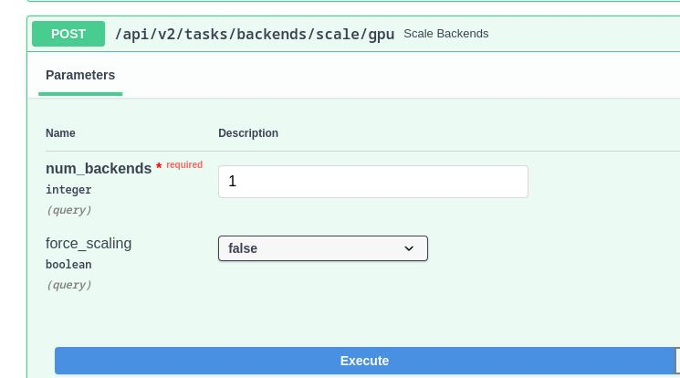

# Troubleshooting

1. Error: "Request timeout"
- Description: inference requests are staying in queue for more than 10 secs.
- Solution: Open NXS swagger page and trigger */api/v2/tasks/backends/scale/gpu* API to add more gpus. 1 GPU per video is recommended. 

2. Error: "No backend is available. Please bring up some backends."
- Description: There is no GPU VMs deployed or somehow the GPU VMs are disconnected due to network problems.
- Solution:
    * Open NXS swagger page and trigger */api/v2/tasks/monitoring/backend_deployments* API to check how many GPU VMs are available
    
    * if *numAvailableGpuBackends* is 0,use */api/v2/tasks/backends/scale/gpu* API to scale up number of GPUs
    * if *numAvailableGpuBackends* is not 0, the GPU VMs may be disconnected due to network issues.
        * Trigger */api/v2/tasks/backends/scale/gpu* API to scale number of GPUs to 0
        * Then use the same */api/v2/tasks/backends/scale/gpu* API to scale number of GPUs up
        * Use */api/v2/tasks/monitoring/backend_deployments* API to check *numAvailableGpuBackends* until all GPU VMs are online

3. Error: Experiments stuck in pending state
- Description: There could be some containers still running without being terminated.
- Solution:
    * Open VCAPP swagger page and trigger */jobs* API to check the UUIDs of experiments which are still occupying resources.
    

    * Trigger */video/terminate* API to destroy the running experiments

    

    * NOTE: In case you want to clean up *all* the running containers, you can use */jobs/clean* API

    

4. How to safely turn off the service
    - You should clear all the running jobs using */jobs/clean* API from VCAPP swagger page

    - Go to the resource group, look for the AKS cluster and open it

    

    - Click "Stop" button and wait until the AKS cluster is successfully stopped.

    

    - Go back to the resource group, look for the Azure Cache for Redis and open it

    
    
    - Click on "Console" to open a terminal

    

    - Run "FLUSHDB" command to clear all the cached data in Redis

    

5. How to turn on the service
    - Go to the resource group, look for the AKS cluster and open it
    - Click on "Start" button and wait until you can access NXS swagger page and VCAPP swagger page
    - Check if GPU VMs are on using */api/v2/tasks/monitoring/backend_deployments* API from NXS swagger page
    - If all the GPU VMs are on, then you can start using the service

