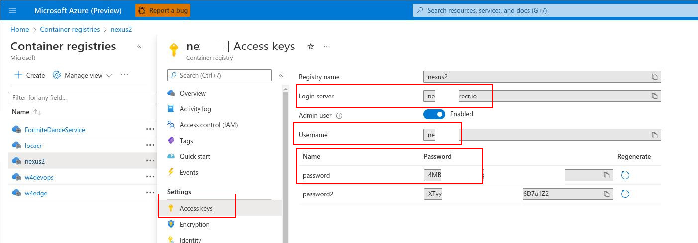
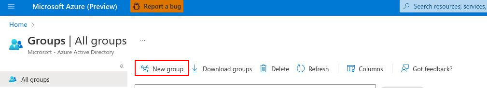
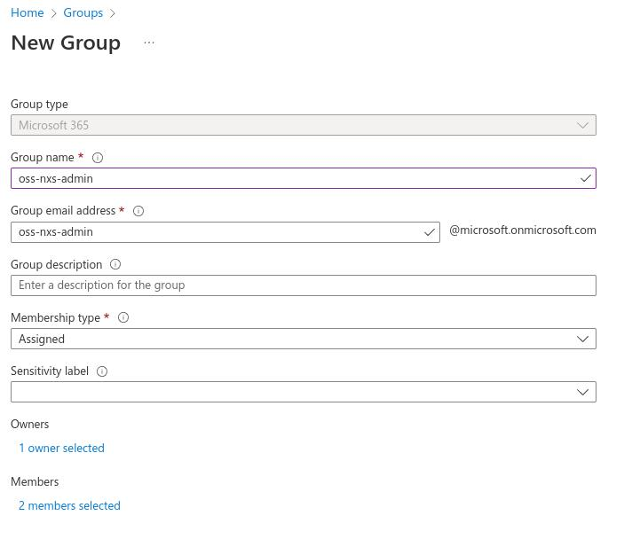
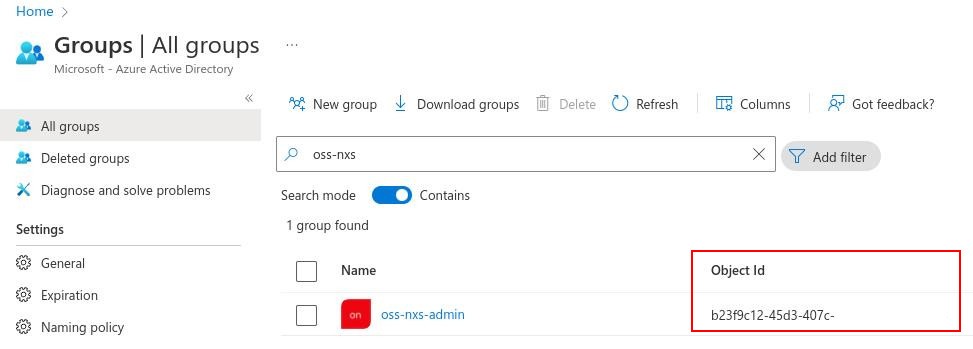
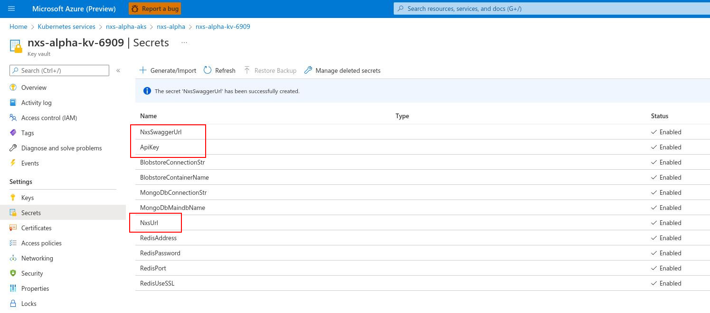

# Terraform deployment

## Requirements
- Access to [NCasT4_v3-series](https://docs.microsoft.com/en-us/azure/virtual-machines/nct4-v3-series) instances 

## Step 1: Build docker container

NOTE: Container **MUST** be built on Linux.

Create azure container registry to store container
```
az login

# replace xxxxxxxx-xxxx-xxxx-xxxx-xxxxxxxxxxxx with your Azure subscription ID
export SUBSRIPTION_ID="xxxxxxxx-xxxx-xxxx-xxxx-xxxxxxxxxxxx"

# replace nxsacrxxx with an unique name
export ACR_NAME="nxsacrxxx"

az account set --subscription $SUBSRIPTION_ID

# create a resource group to host ACR
az group create --name nxsrg --location westus2


az acr create --resource-group nxsrg --name $ACR_NAME --sku Basic
```

NOTE: if "az acr create" fails, choose another name.

Build container **ON LINUX** and push it to ACR
```
# replace nxsacrxxx with the chosen name above
docker build -f Dockerfile -t ${ACR_NAME}.azurecr.io/nxs/dev:v0.1.0 .

# login into acr
az acr login -n $ACR_NAME
docker push ${ACR_NAME}.azurecr.io/nxs/dev:v0.1.0
```
Go to [Azure Portal](https://ms.portal.azure.com/)

Search for "container registries", go to your created ACR above



***Choose "Access keys", enable "Admin user" and take note of "Login server", "Username" and "password".***

## Step 2: Create admin group as owner of NXS deployment
Go to [Azure Portal](https://ms.portal.azure.com/)

Go to "Groups", click New group



Choose your "Group name" and "Group email address", also add current user into "Onwers" and "Members" list, and click "Create"



After group is created, use the search bar to search your group



***Take note of the "Object Id" for your group.***

## Step 3: Deploy NXS to Azure

Edit terraform/envs/nxs/main.tf
```
# do not put special or uppercase characters in deployment_name
locals {
  deployment_name = "demo"                                    # change this to your deployment name
}

module "nxs" {
  source = "../../modules/nxs-oss/root"  
  subscription_id       = ""                                  # user's subscription_id
  tenant_id             = ""                                  # user's tenant_id
  deployment_name       = local.deployment_name
  rg_name               = "nxs-${local.deployment_name}"
  location              = ""                                  # location to deploy (e.g., westus2)
  admin_group_object_id = ""                                  # admin group of this deployment
  ssl_cert_owner_email  = ""                                  # email to register for let's encrypt ssl certificate for secured connection between clients and nxs
  aks_cpu_node_vm_size  = "Standard_D2s_v4"
  aks_min_cpu_node_count = 3  # minimum number of cpu nodes, should be at least 3 for Standard_D2s_v4 with oss-redis
  aks_max_cpu_node_count = 4  # maximum number of cpu nodes, should be at least aks_min_cpu_node_count
  aks_gpu_node_vm_size  = "Standard_NC4as_T4_v3"
  aks_min_gpu_node_count = 1  # minimum number of gpu nodes, can be 0 to save cost during idle but users have to manually scale it up using API call.
  aks_max_gpu_node_count = 1  # maximum number of gpu nodes, should be at least aks_min_gpu_node_count
  acr_login_server      = ""              # change this to login server noted in step 1
  acr_username          = ""              # change this to username noted in step 1
  acr_password          = ""              # change this to password noted in step 1
  nxs_scheduler_image             = "nxsacrxxx.azurecr.io/nxs/dev" # change nxsacrxxx.azurecr.io to your acr_login_server
  nxs_scheduler_image_tag         = "v0.1.0"
  nxs_workload_manager_image      = "nxsacrxxx.azurecr.io/nxs/dev" # change nxsacrxxx.azurecr.io to your acr_login_server
  nxs_workload_manager_image_tag  = "v0.1.0"
  nxs_backend_monitor_image      = "nxsacrxxx.azurecr.io/nxs/dev" # change nxsacrxxx.azurecr.io to your acr_login_server
  nxs_backend_monitor_image_tag  = "v0.1.0"
  nxs_backend_gpu_image           = "nxsacrxxx.azurecr.io/nxs/dev" # change nxsacrxxx.azurecr.io to your acr_login_server
  nxs_backend_gpu_image_tag       = "v0.1.0"
  nxs_api_image                   = "nxsacrxxx.azurecr.io/nxs/dev" # change nxsacrxxx.azurecr.io to your acr_login_server
  nxs_api_image_tag               = "v0.1.0"  
  use_azure_redis_cache           = true                          # set to true if you want to use azure redis cache  
  az_redis_cache_capacity         = 2                             # check https://azure.microsoft.com/en-us/pricing/details/cache
  aks_max_num_api_containers      = 4                             # autoscale number of API frontend to keep up with incoming requests
}

output nxs_url {
  value = module.nxs.nxs_url
}

output nxs_api_key {
  value = module.nxs.nxs_api_key
  sensitive = true
}
```

Deploy NXS
```
cd terraform/envs/nxs

terraform init

# check the deployment plan for anything unusual.
terraform plan

terraform apply
```

Once the deployment is finished, there would be a keyvault under new resource group. 



Go to "Secrets", you'll find the url to the swagger page in "NxsSwaggerUrl" and the api key to access the APIs in "ApiKey".

The base URL of NXS would be stored in "NxsUrl".

Use the examples in [README](readme.md) to test the deployment.